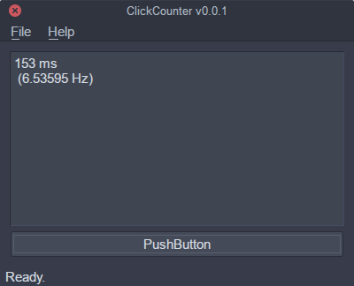

# ClickCounter v0.0.1

See how quickly you can click!

Inspired by this snippet of Javascript:

    (function f(fun) {
        fun();
        setTimeout(() => {
            f(fun)
        }, 1000 * Math.random())
    })(() => { pet(); })

I can click as quickly as 151 ms (1000/151 = 6.6 Hz).

# Building

    $ qmake
    $ make

# Screenshot

